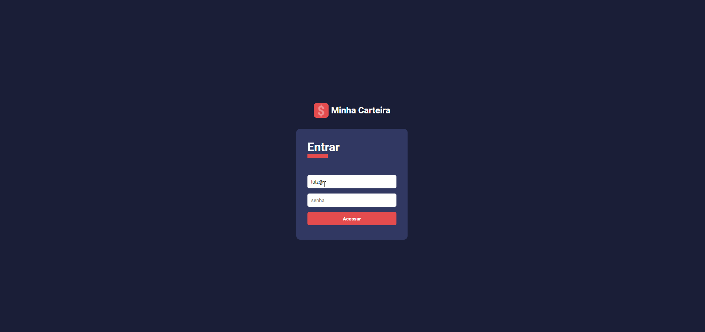

 <h1 align="Left">  
  
  <Strong>Minha Carteira</Strong>
 </h1>

<h1>
  
<h1>

# Índice

- [Sobre](#-sobre)
- [Tecnologias Utilizadas](#-tecnologias-utilizadas)
- [Como baixar o projeto](#-como-baixar-o-projeto)

---

# 📈 Sobre

Projeto **minha carteira** é um Dashboard utilizando ReactJS e TypeScript que possui um layout responsivo com Grid Layout e Flexbox. O projeto ainda conta com 2 opções de temas. 

---

## 💻 Tecnologias utilizadas

O projeto foi desenvolvido utilizando as seguintes tecnologias?

- ReactJS;
- TypeScript;
- Styled Components; 
- Recharts;

---

## 📁 Como baixar o projeto

``` bash

# Clonar o repositório
  $ git clone https://github.com/LuizTimboAlcantara/minha_carteira_react_typescript.git

# Entrar na pasta do projeto
  $ cd minha_carteira_react_typescript

# Instalar as dependências do projeto
  $ yarn install

# Rodar a aplicação
  $ yarn start

# Dados para efetuar login
  $ email: luiz@email.com
  $ senha: abc@123
```
